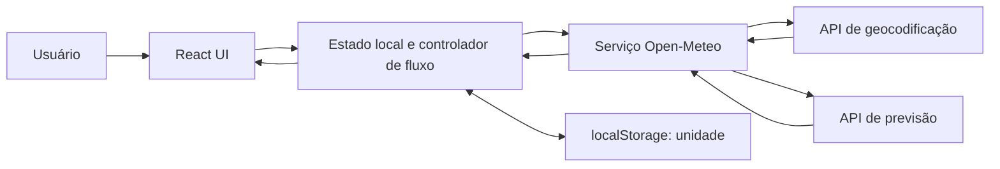
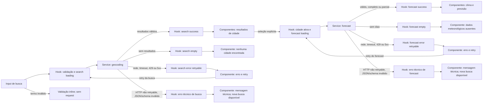

# Weather App — Technical Plan

Este plano deriva de `specs/weather-app-spec.md`. Ele define decisões de
arquitetura, contratos e validação do MVP; não implementa a aplicação.

## Architecture

A aplicação será uma SPA React estática. O navegador consulta diretamente as
APIs HTTPS do Open-Meteo; não haverá backend, autenticação, cache persistente
ou serviço global de estado.



Responsabilidades:

- **Apresentação (`components/`)**: componentes React recebem dados, callbacks e
  estados por props; apresentam busca, resultados, clima, previsão, mensagens e
  atribuição. Não fazem chamadas de rede nem leem/escrevem armazenamento.
- **Orquestração/estado (`hooks/`)**: `useWeatherApp` coordena busca, seleção,
  previsão, retry, cancelamento e unidade; converte ações da UI em chamadas ao
  serviço e expõe estado/ações para os componentes.
- **Acesso a dados (`services/`)**: `openMeteo` monta requests, aplica timeout,
  chama `fetch`, valida respostas e mapeia JSON externo para tipos de domínio.
  Não conhece componentes nem estado React.
- **Funções puras (`lib/`)**: conversão de temperatura, mapeamento WMO,
  desambiguação/rotulagem, cálculo de horário e formatação. Não acessa rede,
  React ou armazenamento.
- **Contratos (`types/`)**: tipos compartilhados entre camadas, sem lógica de
  UI ou efeitos colaterais.

Dependências seguem uma direção simples: `components -> hooks -> services`,
com `lib/` e `types/` usados por quem precisar. `useWeatherApp` importa
diretamente as funções tipadas de `services/openMeteo.ts`; testes de hook mockam
esse módulo. Não se cria container de DI, camada de repositório ou store global.

## Tech Stack

- React 19 e React DOM 19: interface de página única já prevista pelo projeto.
- TypeScript strict: contratos explícitos para respostas externas e estados.
- Vite 8: desenvolvimento e build estático existentes.
- Tailwind CSS 3 com o tema dark glassmorphism definido pelas instruções do
  projeto.
- Vitest, jsdom e Testing Library: testes unitários e de componentes.
- Playwright: testes E2E configurados para Chromium desktop e viewport mobile.
- Biome: lint e formatação existentes.
- pnpm: gerenciador definido no repositório.
- `fetch`, `AbortController`, `Intl` e `localStorage`: APIs nativas suficientes
  para rede, cancelamento, localização e preferência; nenhuma biblioteca de
  estado ou cliente HTTP adicional é necessária.

## Project Structure

Estrutura-alvo proposta; atualmente o workspace ainda não contém `src/` nem
`tests/`.

```text
src/
  App.tsx
  main.tsx
  components/
    Attribution.tsx
    CityResults.tsx
    CurrentWeather.tsx
    DailyForecast.tsx
    SearchForm.tsx
    StatusMessage.tsx
    UnitToggle.tsx
  hooks/
    useWeatherApp.ts
  services/
    openMeteo.ts
  lib/
    cityLabel.ts
    formatWeather.ts
    freshness.ts
    temperature.ts
    weatherCodes.ts
  types/
    weather.ts
  index.css
tests/
  setup.ts
  unit/
    services/
      openMeteo.test.ts
    lib/
      cityLabel.test.ts
      freshness.test.ts
      temperature.test.ts
      weatherCodes.test.ts
    hooks/
      useWeatherApp.test.tsx
    components/
      WeatherApp.test.tsx
  e2e/
    weather-flow.spec.ts
```

Manter os arquivos de teste nos diretórios já referenciados por `vite.config.ts`
e `playwright.config.ts`. `lib/` reúne lógica pura; não criar diretórios de
backend, cache ou estado compartilhado.

## Data Model

Tipos de domínio propostos (contratos, não implementação):

```ts
type Unit = 'celsius' | 'fahrenheit';

interface City {
  id: number; // Identificador do resultado de geocodificação.
  name: string; // Nome da cidade retornado pela busca.
  country?: string; // País, quando fornecido.
  administrativeRegions: string[]; // Regiões admin1-admin4 disponíveis, em ordem.
  latitude: number; // Latitude usada na consulta de previsão.
  longitude: number; // Longitude usada na consulta de previsão.
}

interface CurrentWeather {
  temperatureC: number; // temperature_2m, normalizada para Celsius.
  apparentTemperatureC?: number; // apparent_temperature, se numérica.
  relativeHumidityPercent?: number; // relative_humidity_2m, se numérica.
  windSpeedKmh?: number; // wind_speed_10m em km/h, se numérica.
  weatherCode: number; // weather_code inteiro; códigos desconhecidos são válidos.
  referenceTime: string; // Instante ISO UTC derivado de current.time e utc_offset_seconds.
}

interface ForecastDay {
  localDate: string; // time diário YYYY-MM-DD no fuso da cidade.
  minimumC: number; // temperature_2m_min, normalizada para Celsius.
  maximumC: number; // temperature_2m_max, normalizada para Celsius.
  weatherCode: number; // weather_code inteiro para o período.
}

interface WeatherData {
  city: City; // Cidade selecionada e consultada.
  timeZone: string; // timezone IANA retornado pela previsão.
  utcOffsetSeconds: number; // Offset usado para interpretar current.time.
  current: CurrentWeather; // Condições atuais da resposta current.
  forecastDays: ForecastDay[]; // De um a cinco dias retornados; sem dias fictícios.
}

type RequestError =
  | {
      kind: 'network' | 'timeout' | 'rate-limit' | 'server';
      message: string;
      retryable: true;
    }
  | {
      kind: 'api' | 'invalid-response';
      message: string;
      retryable: false;
    };

type SearchState =
  | { status: 'idle' }
  | { status: 'loading' }
  | { status: 'success'; results: City[] }
  | { status: 'empty' }
  | { status: 'error'; error: RequestError };

type ForecastState =
  | { status: 'idle' }
  | { status: 'loading' }
  | { status: 'success'; data: WeatherData; partial: boolean }
  | { status: 'empty' }
  | { status: 'error'; error: RequestError };
```

Regras de domínio: temperaturas permanecem em Celsius; conversão é apenas de
apresentação e arredonda para inteiro. `weatherCode` é inteiro: códigos WMO
listados usam a tabela da spec; outros inteiros usam o fallback neutro. Campos
atuais opcionais inválidos são omitidos. Resposta estruturalmente incompatível
não gera `WeatherData`.

## Data Flow

1. O usuário envia o formulário; aparar o termo e rejeitar valores com menos de
   dois caracteres antes da rede.
2. O serviço solicita no máximo cinco cidades. Itens sem `id`, nome ou
   coordenadas válidas são descartados; campos administrativos são opcionais.
3. A UI exibe resultados distintos por `id`. Para rótulos ainda iguais,
   apresenta coordenadas com quatro casas e, se necessário, posição na lista.
4. A seleção torna a cidade ativa e inicia a previsão com suas coordenadas.
5. O serviço valida toda a resposta antes de mapear unidades, horários e dias
   para o modelo de domínio. Retorna de zero a cinco dias; uma lista vazia é
   ausência de dados e uma lista parcial permanece parcial.
6. A UI apresenta clima e previsão no fuso IANA retornado, formatados com
   `Intl`/`pt-BR`. A atribuição do provedor acompanha os dados meteorológicos.
7. Alterar a unidade recalcula apenas os valores visíveis; não inicia chamadas.



## External APIs

As integrações são chamadas `GET` HTTPS feitas pelo navegador, sem API key. Os
parâmetros devem ser serializados com `URL`/`URLSearchParams`; não concatenar
termos de busca diretamente na URL.

### Geocoding

- Endpoint: `https://geocoding-api.open-meteo.com/v1/search`
- Query: `name=<termo aparado>`, `count=5`, `language=pt`, `format=json`.
- `current`, `daily` e `timezone` não se aplicam a este endpoint.
- Exemplo resumido de sucesso (a API pode retornar outros campos):

```json
{
  "results": [
    {
      "id": 3452925,
      "name": "Sao Paulo",
      "latitude": -23.5475,
      "longitude": -46.63611,
      "country": "Brazil",
      "admin1": "Sao Paulo",
      "admin2": "Sao Paulo"
    }
  ]
}
```

- Mapeamento para `City`: `id`, `name`, `latitude` e `longitude` são
  obrigatórios. `country` é opcional. Monte `administrativeRegions` com os
  valores não vazios de `admin1` a `admin4`, preservando a ordem. Preserve cada
  item válido por `id`; não deduplique resultados distintos. Ausência da
  propriedade `results` significa busca sem resultados; `results` presente
  deve ser uma lista.

### Forecast

- Endpoint: `https://api.open-meteo.com/v1/forecast`
- Query obrigatória: `latitude=<City.latitude>`,
  `longitude=<City.longitude>`, `forecast_days=5`, `timezone=auto`.
- `current=temperature_2m,apparent_temperature,relative_humidity_2m,wind_speed_10m,weather_code`.
- `daily=weather_code,temperature_2m_min,temperature_2m_max`.
- Exemplo resumido; as listas foram encurtadas para dois períodos apenas para
  ilustrar o formato. A resposta real pode conter até cinco:

```json
{
  "latitude": -23.55,
  "longitude": -46.63,
  "utc_offset_seconds": -10800,
  "timezone": "America/Sao_Paulo",
  "current_units": {
    "temperature_2m": "°C",
    "apparent_temperature": "°C",
    "relative_humidity_2m": "%",
    "wind_speed_10m": "km/h",
    "weather_code": "wmo code"
  },
  "current": {
    "time": "2026-09-30T09:00",
    "temperature_2m": 21.4,
    "apparent_temperature": 22.1,
    "relative_humidity_2m": 64,
    "wind_speed_10m": 10.8,
    "weather_code": 2
  },
  "daily_units": {
    "temperature_2m_min": "°C",
    "temperature_2m_max": "°C",
    "weather_code": "wmo code"
  },
  "daily": {
    "time": ["2026-09-30", "2026-10-01"],
    "temperature_2m_min": [16.2, 17.0],
    "temperature_2m_max": [24.8, 25.3],
    "weather_code": [2, 3]
  }
}
```

- Mapeamento para `WeatherData`: anexe o `City` selecionado; `timezone` vai
  para `timeZone` e `utc_offset_seconds` para `utcOffsetSeconds`. Mapeie
  `current.temperature_2m` e os opcionais correspondentes para os campos
  Celsius/percentual/km/h de `CurrentWeather`; `weather_code` permanece inteiro.
  Converta `current.time` (horário civil local) em timestamp ISO UTC usando
  `utc_offset_seconds` e atribua a `referenceTime`.
- Para cada índice `i` das listas `daily`, crie um `ForecastDay` com
  `localDate = time[i]`, `minimumC = temperature_2m_min[i]`,
  `maximumC = temperature_2m_max[i]` e `weatherCode = weather_code[i]`.
  Valide comprimentos iguais e valores/data válidos antes de mapear. Preserve
  somente os períodos retornados, sem fabricar dias; uma lista vazia é ausência
  de dados.
- Ausência ou invalidade de campos opcionais atuais os omite. Resposta que
  falhar na validação obrigatória não produz `WeatherData` nem atualiza a UI.

### Request and Attribution Policy

Cada chamada tem timeout de 10 s. Aceitar somente HTTP 2xx com JSON compatível;
timeout, rede, HTTP 429 e 5xx permitem uma ação de retry da mesma operação.
Outras respostas HTTP, JSON inválido ou incompatibilidade são erros técnicos,
sem retry. Usar `AbortController` e ignorar respostas obsoletas. Exibir
atribuição visível ao Open-Meteo com link HTTPS; verificar e registrar termos e
créditos exigidos antes da publicação, que permanece bloqueada até a checagem.
O registro será mantido em `docs/release-checklist.md`, a ser criado na etapa de
release, com URL/versão dos termos consultados, data e responsável pela revisão,
créditos exigidos, local da atribuição implementada e resultado aprovado. Sem
registro aprovado, a publicação não pode prosseguir.

## State Management

O estado da aplicação vive no hook `useWeatherApp`, no nível de `App`, e é
mantido por `useReducer`; não usar store global. O estado contém o termo de
busca, resultados, cidade selecionada, relatório meteorológico, unidade e dois
estados independentes: `searchState: SearchState` e
`forecastState: ForecastState`. Cada tipo só admite os estados vazios e dados
válidos para sua operação; uma busca nova não altera acidentalmente o estado da
previsão.

- `idle`: operação ainda não iniciada ou reiniciada após nova ação.
- `loading`: request em andamento; apresentar feedback imediatamente.
- `success`: resultados válidos disponíveis. Forecast carrega `partial: true`
  quando há de um a quatro dias; search sempre contém ao menos uma cidade.
- `empty`: busca sem cidades ou forecast sem dias; são estados vazios distintos
  por tipo de operação. Não criar dados para preencher o resultado.
- `error`: contém `RequestError`. O tipo associa `retryable: true` somente a
  rede, timeout, 429 e 5xx; erros HTTP/API e resposta incompatível são sempre
  não repetíveis.

As temperaturas de `WeatherData` ficam sempre em Celsius. `Unit` determina
somente a apresentação: componentes chamam uma função pura de `lib/` durante a
renderização para converter Celsius para Celsius ou Fahrenheit
($F = C \times 9/5 + 32$) e arredondar para inteiro. Isso inclui temperatura
atual, sensação térmica e mínimas/máximas. A troca de unidade atualiza `Unit` e
re-renderiza; não modifica o relatório nem chama geocoding/forecast. Uma troca
feita durante loading também será aplicada quando os dados chegarem.

Manter um `AbortController` e um identificador crescente por tipo de chamada.
Cancelar ou ignorar resposta anterior; somente o identificador atual pode
atualizar o estado. Abortos causados por ação mais recente não são erros
visíveis.

Persistir somente a unidade em `localStorage`. Na inicialização, aceitar apenas
`celsius`/`fahrenheit`; para valor inválido ou exceção de armazenamento, usar
Celsius. Falha de leitura/escrita nunca bloqueia a consulta. Não persistir
termo, cidade, coordenadas ou resposta meteorológica.

## Error Handling

| Falha/condição | Classificação e estado | Mensagem/ação |
|---|---|---|
| Falha de conexão (`fetch` rejeitado, exceto abort controlado) | `network`, `error`, retryable | Informar indisponibilidade e oferecer uma única ação de retry da mesma operação. |
| Timeout após 10 s | `timeout`, `error`, retryable | Informar demora/timeout e oferecer retry; a tentativa anterior é encerrada. |
| HTTP 429 | `rate-limit`, `error`, retryable | Informar limite temporário e oferecer retry manual. |
| HTTP 5xx | `server`, `error`, retryable | Informar indisponibilidade do provedor e oferecer retry manual. |
| Outro HTTP não 2xx ou erro explícito da API | `api`, `error`, não retryable | Mensagem técnica concisa; manter busca disponível. |
| JSON inválido ou incompatível com o contrato | `invalid-response`, `error`, não retryable | Não exibir dados da resposta; permitir nova busca. |
| Abort provocado por ação mais recente | Não é erro; manter estado da ação mais nova | Sem mensagem nem retry. |

Termo inválido é erro de validação do formulário, sem request e sem retry.
Busca sem resultados e forecast sem dias são `empty`, não falhas de API. Um
forecast válido com um a quatro dias é `success` parcial: mostrar somente os
dias recebidos e a mensagem de previsão incompleta, sem retry automático ou
períodos inventados. Campos meteorológicos opcionais ausentes são omitidos.

Cada request tem timeout de 10 s e o loading deve aparecer em até 100 ms. Retry
existe somente para `network`, `timeout`, `rate-limit` e `server`; repete apenas
a operação que falhou, fica desabilitado durante sua execução e não é duplicado.
Anunciar loading/status com `role="status"` e erros com `role="alert"`. Dados
com horário de referência acima de 24 h recebem o aviso da spec; horário ou
offset inválido torna a resposta incompatível. Códigos WMO desconhecidos
continuam válidos e usam o fallback acessível.

## Testing Strategy

Usar a configuração existente: `pnpm test` para Vitest/Testing Library,
`pnpm test:e2e` para Playwright e os gates do repositório (`pnpm lint`,
`pnpm build`). Unitários e testes de componentes são determinísticos e não
dependem da disponibilidade do Open-Meteo; Playwright cobre o fluxo integrado
com endpoints mockados.

**Vitest / Testing Library**

- `lib/`: testar Celsius/Fahrenheit e arredondamento; códigos WMO e fallback;
  rótulos de homônimos; conversão do horário e limite de 24 horas. São funções
  puras, portanto não precisam de mocks.
- `services/`: mockar `fetch`; verificar URLs/parâmetros, mapeamento e validação
  de respostas, campos opcionais, diária parcial/desalinhada, HTTP 429/5xx e
  outros HTTP, JSON inválido, timeout de 10 s e cancelamento.
- `hooks/`: mockar o serviço; verificar transições `idle → loading → success`,
  `empty` e `error`, respostas obsoletas, retry da operação certa, estados de
  busca/previsão independentes, `localStorage` indisponível e preferência
  persistida inválida voltando a Celsius.
- Componentes com Testing Library: renderizar explicitamente os estados
  `idle`, `loading`, `success`, `empty` e `error`; conferir mensagens, dados
  parciais, campos opcionais omitidos, indicador acessível, retry desabilitado
  durante loading, operação por teclado, foco visível, nomes/labels semânticos
  e estados que não dependem somente de cor. Em estado retryable, afirmar que
  existe exatamente uma ação de retry e que fica desabilitada durante a tentativa.
  A UI recebe props e não chama `fetch`.
- Auditar contraste de texto e controles conforme WCAG 2.2 AA no navegador;
  registrar o resultado por viewport/tema. Esta verificação visual não é
  atribuída ao Testing Library.
- Testar que a troca de unidade re-renderiza todas as temperaturas convertidas
  sem chamar o serviço novamente, inclusive quando a unidade muda durante o
  carregamento.

**Playwright**

- Interceptar os dois endpoints com `page.route`; não depender da rede ou dos
  dados variáveis do provedor.
- Cobrir busca válida/vazia/curta, exibição de resultados homônimos, seleção e
  URL de forecast com as coordenadas selecionadas.
- Cobrir clima atual e cinco dias, previsão parcial sem dias fabricados,
  campos opcionais ausentes, código WMO desconhecido e aviso de dados antigos.
- Cobrir timeout, falha de rede, 429/5xx com retry, erro técnico sem retry e
  resposta anterior ignorada após ação mais recente. Verificar exatamente um
  controle de retry no erro retryable, desabilitado enquanto o request repetido
  está pendente.
- Medir do início de busca, seleção ou retry até a exibição do estado loading;
  afirmar que o feedback aparece em até 100 ms enquanto a resposta mockada fica
  pendente, conforme NFR01.
- Cobrir alternância de unidade sem request adicional, persistência/restauração
  apenas da unidade, fluxo de teclado, anúncios acessíveis e link de atribuição.
- Validar ausência de overflow horizontal em 320, 768 e 1440 px, em orientação
  retrato e paisagem. A configuração atual roda Chromium desktop e dispositivo
  mobile; executar explicitamente as larguras e orientações requeridas.
- Verificar as versões estáveis atual e imediatamente anterior de Chrome, Edge,
  Firefox e Safari nas plataformas em que cada navegador estiver disponível.
  Automatizar Chromium no CI e registrar a validação manual de Edge, Firefox e
  Safari, incluindo versão e plataforma testadas.

Usar critérios de aceite da spec como fonte dos cenários; a matriz de
rastreabilidade relaciona histórias, ACs e NFRs para derivar tarefas/testes.

## Risks & Trade-offs

- **Open-Meteo direto no navegador:** escolhido por não exigir backend ou chave
  própria e por corresponder à spec. Alternativa: proxy/backend, que daria mais
  controle de quota e observabilidade, mas adicionaria infraestrutura e uma
  camada expressamente fora do MVP. Trade-off: CORS, rede, quota e disponibilidade
  do provedor afetam diretamente a UI.
- **`fetch` nativo e sem cache:** escolhidos para manter dependências mínimas e
  evitar retries/cache implícitos. Alternativas: Axios ou TanStack Query; ambos
  adicionariam abstração e, no caso de cache/retry automático, poderiam violar
  as regras explícitas da spec. O custo é implementar timeout, cancelamento e
  classificação de erros no serviço.
- **`useReducer` local, sem store global:** adequado ao estado limitado a uma
  única SPA e torna transições testáveis. Alternativas: Redux/Zustand ou Context
  global, que ampliariam o escopo sem benefício de compartilhamento entre telas.
- **Celsius como dado canônico e conversão na renderização:** evita requests ao
  alternar unidade e impede perda de precisão por conversões sucessivas.
  Alternativa: pedir Fahrenheit novamente à API, contrariando a spec e criando
  tráfego e estados concorrentes.
- **Mostrar previsão parcial válida:** segue a spec e não inventa períodos;
  alternativa: falhar o relatório inteiro se faltar um dia, sacrificando dados
  úteis que a fonte forneceu.
- **Sem cache/offline:** evita apresentar respostas antigas sem suporte da spec.
  Alternativa: cache em memória ou persistente, que exigiria TTL, invalidação e
  política offline; permanece fora do MVP.
- **Testes de integração com API mockada:** dão resultados reproduzíveis e
  verificam cenários de erro; chamar o Open-Meteo real nos testes seria uma
  alternativa sujeita a quota, latência e indisponibilidade, por isso fica
  restrita à verificação manual quando necessária.
- **Homônimos e dados parciais:** coordenadas/posição identificam cidades quando
  nomes coincidem, mas são menos familiares; selecionar explicitamente mantém
  a decisão com o usuário. Mostrar dias parciais melhora utilidade, mas deixa a
  previsão incompleta.
- **Horário do modelo:** `current.time` é horário de referência, não observação
  direta; calcular idade depende do relógio do dispositivo e do offset retornado.
- **Atribuição e termos:** publicar depende da verificação registrada dos
  créditos/licença exigidos; o crédito visual padrão não substitui essa revisão.
- **Sem telemetria/uptime no MVP:** reduz coleta de dados e operação, mas limita
  diagnóstico de produção. Alternativa futura é observabilidade com minimização
  de dados e SLI/SLO definidos; não faz parte desta entrega.